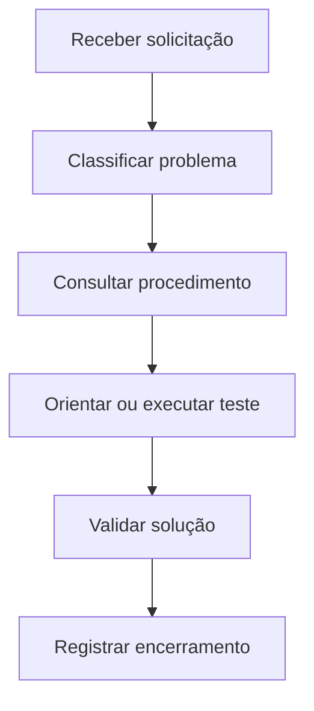

# Base de Conhecimento de Suporte

Base de conhecimento de estudo com procedimentos simples para atendimento de usuários, registro de chamados e solução de problemas recorrentes.

## Objetivo

Demonstrar organização, comunicação técnica e capacidade de transformar soluções em procedimentos reutilizáveis.

## Artigos

| Artigo | Aplicação |
|---|---|
| [Redefinição de senha](artigos/redefinicao-de-senha.md) | Orientar o usuário com segurança |
| [Acesso ao Wi-Fi](artigos/acesso-ao-wifi.md) | Investigar falhas de conexão sem fio |
| [Problema com e-mail](artigos/problema-com-email.md) | Fazer diagnóstico inicial de acesso |
| [Computador sem internet](artigos/computador-sem-internet.md) | Registrar testes básicos de rede |

## Modelos

- [Registro de chamado](modelos/registro-de-chamado.md)
- [Encerramento de chamado](modelos/encerramento-de-chamado.md)

## Fluxo de atendimento

## Estrutura dos artigos

Cada procedimento deve conter:

- Objetivo;
- Sintomas;
- Perguntas iniciais;
- Procedimentos seguros;
- Resultado esperado;
- Quando encaminhar;
- Observações.

## Boas práticas

- Usar linguagem simples.
- Não solicitar senhas.
- Confirmar a identidade conforme a política da empresa.
- Registrar somente as informações necessárias.
- Não prometer prazo ou solução sem confirmação.
- Encaminhar problemas fora do escopo N1.
- Atualizar o artigo quando o procedimento mudar.

## Observação

Este é um projeto de estudo. Os procedimentos devem ser adaptados às ferramentas, políticas e sistemas de cada organização.
