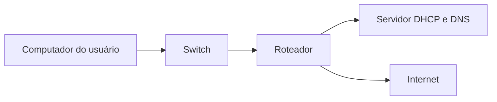

# Laboratório de Redes Básicas

Laboratório de estudo para praticar conceitos essenciais de redes usados em Suporte de TI e Help Desk.

## Objetivo

Demonstrar uma sequência básica para entender e investigar problemas de conectividade em uma rede local.

## Conceitos praticados

- IPv4
- Máscara de rede
- Gateway
- DNS
- DHCP
- Comunicação entre dispositivos
- Testes com `ping`, `ipconfig`, `tracert` e `nslookup`

## Topologia de referência

## Cenários

| Cenário | Objetivo |
|---|---|
| [Rede LAN básica](cenarios/rede-lan-basica.md) | Verificar IP, gateway e comunicação local |
| [Diagnóstico de DNS](cenarios/diagnostico-dns.md) | Diferenciar falha de internet de falha de resolução de nomes |

## Sequência inicial de diagnóstico

1. Verificar se o adaptador está conectado.
2. Consultar o endereço IP com `ipconfig`.
3. Testar o próprio endereço de rede.
4. Testar o gateway com `ping`.
5. Testar um endereço externo.
6. Testar a resolução de nomes com `nslookup`.
7. Comparar os resultados.
8. Registrar a causa provável e o procedimento realizado.

## Interpretação básica

| Resultado | Possível indicação |
|---|---|
| Sem endereço IPv4 | Problema no adaptador ou DHCP |
| Gateway inacessível | Falha local, cabo, Wi-Fi ou roteador |
| IP externo responde, mas domínio não | Possível falha de DNS |
| Nenhum dispositivo acessa | Possível problema no roteador ou provedor |
| Apenas um sistema falha | Investigar o computador ou aplicativo |

## Ferramentas

- Cisco Packet Tracer ou ambiente de laboratório equivalente
- Windows
- Prompt de Comando
- PowerShell
- Markdown
- Diagramas Mermaid

## Boas práticas

- Não alterar a rede de uma empresa sem autorização.
- Registrar a configuração antes de fazer mudanças.
- Não expor endereços, senhas ou dados reais.
- Testar uma hipótese por vez.
- Encaminhar problemas de infraestrutura quando estiverem fora do escopo N1.

## Observação

Este é um laboratório de estudo. Os endereços e cenários são exemplos e não representam uma rede real de cliente.
