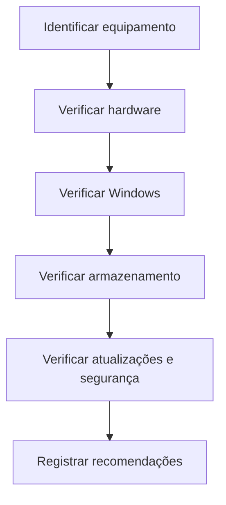

# Manutenção Preventiva de Computadores

Checklist e procedimentos básicos para organizar a manutenção preventiva de computadores Windows.

Projeto de estudo voltado para Suporte de TI, Help Desk e Suporte N1.

## Objetivo

Demonstrar um processo seguro para avaliar o estado básico de um computador, identificar riscos e registrar recomendações.

## Etapas da manutenção

## Checklists

| Checklist | Finalidade |
|---|---|
| [Hardware](checklists/hardware.md) | Verificar componentes e condições físicas |
| [Windows](checklists/windows.md) | Conferir sistema, desempenho e atualizações |
| [Segurança](checklists/seguranca.md) | Conferir práticas básicas de proteção |
| [Ordem de serviço](modelos/ordem-de-servico.md) | Registrar o atendimento realizado |

## Boas práticas

- Fazer backup antes de qualquer alteração de risco.
- Não abrir o equipamento sem autorização e conhecimento técnico.
- Não apagar arquivos pessoais sem confirmação.
- Não solicitar ou registrar senhas.
- Utilizar somente ferramentas confiáveis.
- Registrar o estado inicial e as alterações realizadas.
- Explicar ao usuário o que foi feito.
- Encaminhar falhas físicas ou problemas complexos.

## Tecnologias e ferramentas

- Windows 10 e 11
- Gerenciador de Tarefas
- Configurações do Windows
- Gerenciamento de Armazenamento
- Windows Update
- PowerShell básico
- Markdown

## Observação

Este é um projeto de estudo. Os procedimentos devem ser adaptados às políticas, ferramentas e autorizações de cada empresa.
