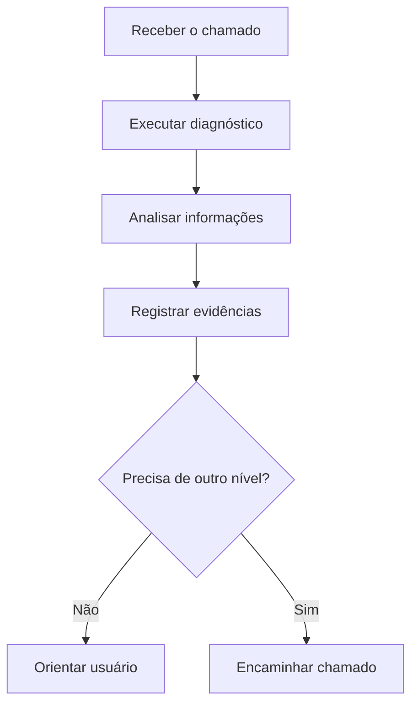

# PowerShell Diagnóstico PC

Scripts simples para coletar informações básicas e realizar verificações iniciais em computadores Windows.

Projeto de estudo voltado para Suporte de TI, Help Desk e Suporte N1.

## Objetivo

Demonstrar como automatizar verificações básicas durante um atendimento técnico, mantendo o procedimento simples, documentado e seguro.

## Scripts

| Script | Finalidade |
|---|---|
| [diagnostico-basico.ps1](scripts/diagnostico-basico.ps1) | Exibe informações do sistema e do computador |
| [verificar-rede.ps1](scripts/verificar-rede.ps1) | Verifica IP, gateway e conectividade |
| [verificar-disco.ps1](scripts/verificar-disco.ps1) | Mostra espaço total e espaço livre dos discos |

## Fluxo de uso



## Como executar

1. Baixe ou clone o repositório.
2. Abra o PowerShell.
3. Navegue até a pasta `scripts`.
4. Execute um script específico:

```powershell
.\diagnostico-basico.ps1
.\verificar-rede.ps1
.\verificar-disco.ps1
```

Se a política de execução impedir o script, consulte a política da empresa antes de fazer qualquer alteração. Não altere configurações de segurança sem autorização.

## Boas práticas

- Executar somente scripts compreendidos e revisados.
- Não coletar senhas ou dados pessoais.
- Não enviar resultados para serviços externos.
- Registrar data, equipamento e motivo do diagnóstico.
- Pedir autorização antes de realizar alterações.
- Adaptar os scripts às regras do ambiente de trabalho.

## Tecnologias

- Windows 10 e 11
- PowerShell
- WMI/CIM
- Comandos de rede
- Markdown

## Observação

Este é um projeto de estudo. Os scripts realizam consultas locais e não substituem as políticas, ferramentas ou procedimentos oficiais de uma empresa.
