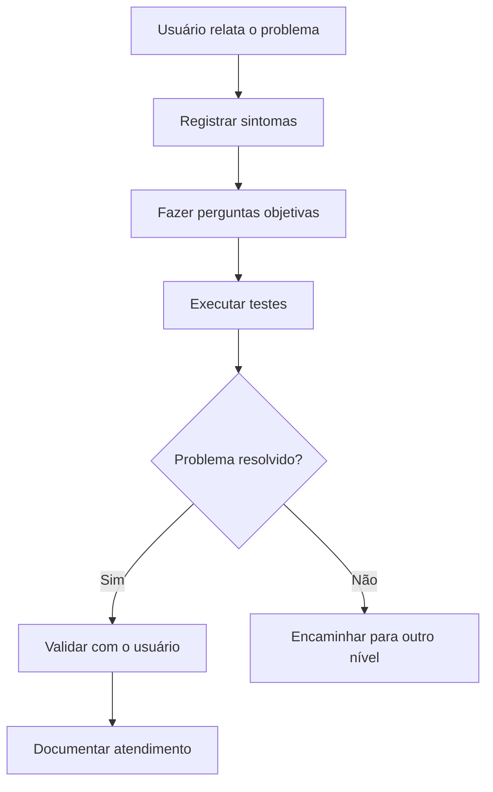

# Troubleshooting Windows

Guia prático de diagnóstico para problemas comuns do Windows, criado como projeto de estudo para Suporte de TI, Help Desk e Suporte N1.

## Índice

- [Objetivo](#objetivo)
- [Problemas documentados](#problemas-documentados)
- [Fluxo de atendimento](#fluxo-de-atendimento)
- [Método de diagnóstico](#método-de-diagnóstico)
- [Ferramentas utilizadas](#ferramentas-utilizadas)
- [Boas práticas](#boas-práticas)

## Objetivo

Demonstrar um processo organizado para investigar problemas, fazer perguntas ao usuário, testar hipóteses e registrar uma solução.

## Problemas documentados

| Problema | O que demonstra |
|---|---|
| [Computador lento](docs/computador-lento.md) | Diagnóstico de desempenho e recursos do sistema |
| [Internet sem acesso](docs/internet-sem-acesso.md) | Investigação de rede, gateway e DNS |
| [Impressora não imprime](docs/impressora-nao-imprime.md) | Verificação de fila, conexão e driver |

## Fluxo de atendimento

## Método de diagnóstico

1. Ouvir e registrar o problema relatado.
2. Identificar os sintomas.
3. Fazer perguntas objetivas.
4. Reproduzir ou testar o problema.
5. Aplicar uma solução segura.
6. Validar com o usuário.
7. Registrar o procedimento realizado.
8. Encaminhar quando o problema exigir outro nível de suporte.

## Checklist de atendimento

Use o [checklist de atendimento](checklist-atendimento.md) para registrar as informações importantes antes, durante e depois do diagnóstico.

## Ferramentas utilizadas

- Windows 10 e 11
- Configurações do Windows
- Gerenciador de Tarefas
- Prompt de Comando
- PowerShell básico
- Comandos `ipconfig`, `ping`, `tracert` e `nslookup`
- Diagnóstico de rede
- Markdown para documentação

## Boas práticas

- Não solicitar senhas do usuário.
- Não apagar arquivos sem confirmação.
- Não executar comandos desconhecidos.
- Fazer backup antes de alterações de risco.
- Registrar os testes realizados.
- Explicar a solução em linguagem simples.
- Encaminhar problemas fora do escopo do atendimento N1.

## Observação

Este é um projeto de estudo e documentação prática. Os procedimentos devem ser adaptados ao ambiente e às políticas de cada empresa.
